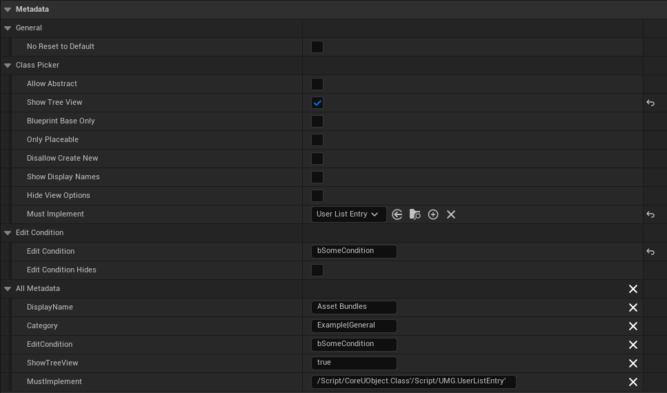
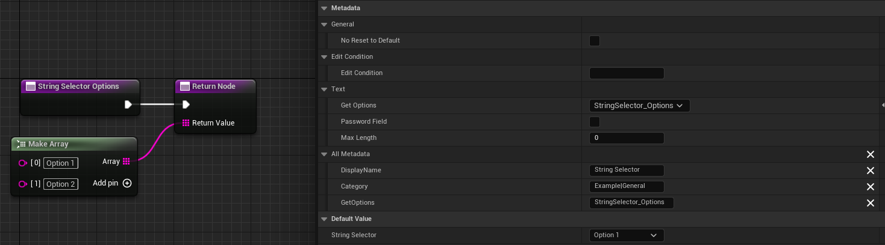
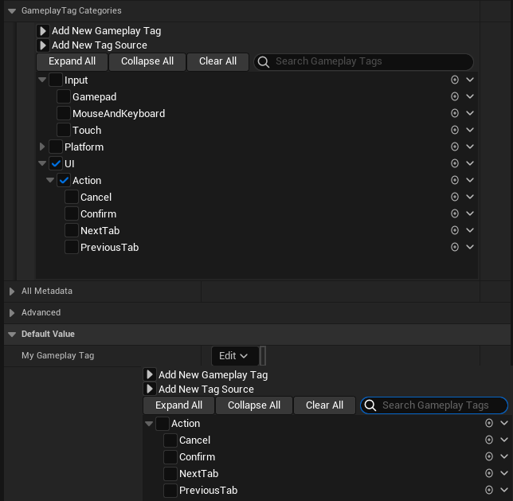

#  Neat Metadata
Editor extension to allow various metadata to be used in Blueprints that is otherwise only available in C++.

## Examples
Some of the possibilities that this plugin exposes. Look at the [supported metadata](https://github.com/pramberg/NeatMetadata/wiki/Supported-Metadata) table to see all available metadata.
|                                            |
|:-------------------------------------------|
| Class Picker                               |
|  |
| Get Options                                |
|         |
| Gameplay Tags                              |
|  |
